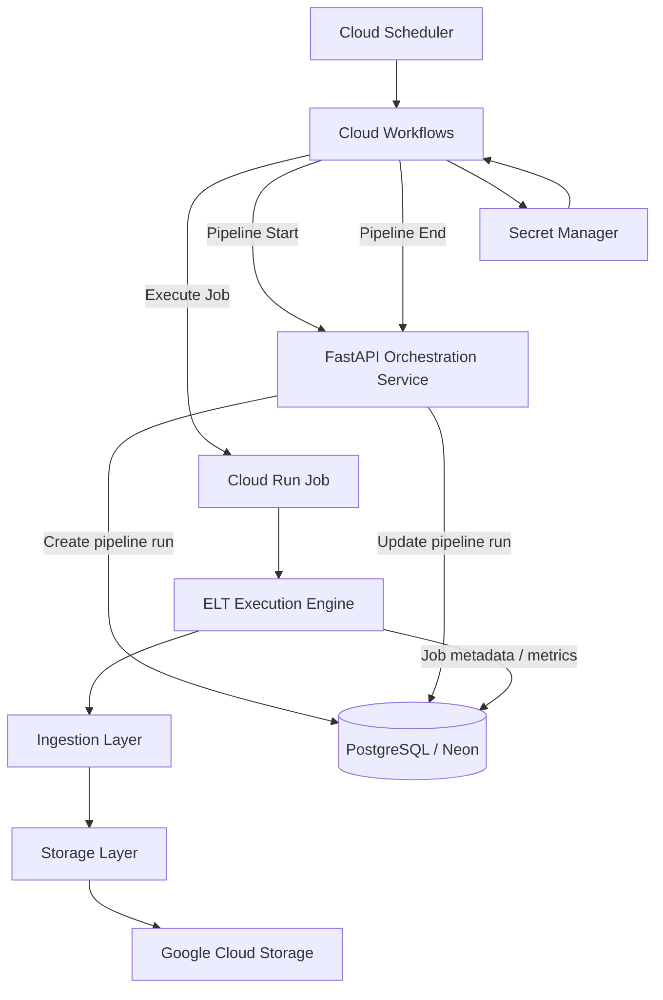
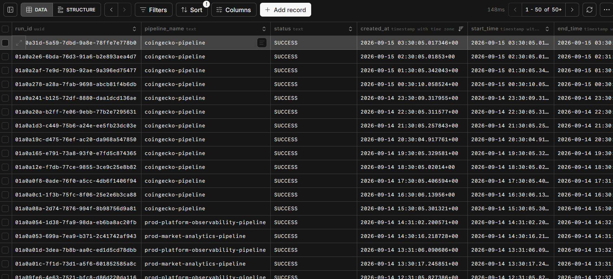
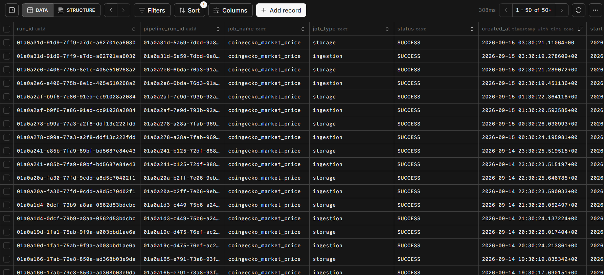

# Configuration-Driven ELT Orchestration Framework - README

Current Version: Prod_v3

Last Updated: 2026-09-15

---

A configuration-driven framework for building and orchestrating ELT pipelines on Google Cloud. Jobs are defined through JSON configuration and executed through a modular ingestion → storage → processing(soon) model, with Google Cloud Workflows coordinating execution and PostgreSQL providing centralized run metadata.

**Core technologies:** Python · FastAPI · GCP · PostgreSQL (Neon) · Terraform · Docker · Github Action (CI)

## Architecture



**Cloud Workflows** coordinates pipeline execution, **Cloud Run Jobs** execute individual ELT jobs, and the **FastAPI service** handles pipeline lifecycle metadata. Job configuration determines the ingestion and storage behavior at runtime.

## Execution Flow

1. Cloud Scheduler triggers the workflow.
2. The workflow retrieves required secrets from Secret Manager.
3. Pipeline start metadata is recorded in PostgreSQL.
4. The workflow invokes the required Cloud Run Job(s).
5. Each job loads and validates its JSON configuration.
6. The ingestion layer retrieves the source data and passes it to the storage layer.
7. Job metrics and execution status are recorded, followed by pipeline completion metadata.

## Configuration

Jobs are defined as JSON configuration files under `framework/elt_system/configs/job/`.

A job defines **what to ingest**, **where to store it** and soon **how to process it**:

```json
{
  "metadata": {
    "source": "coingecko",
    "dataset": "market_price",
    "entity": "cryptocurrency"
  },
  "layer": {
    "ingestion": {
      "ingestion_type": "API",
      "path": "/coins/markets",
      "query_params": {
        "vs_currency": "inr"
      }
    },
    "storage": {
      "storage_type": "GCS",
      "bucket": "dev-bucket",
      "format": "parquet",
      "path_template": "{source}/{dataset}/{entity}/ingestionDT={ingestionDT}/jobRunID={jobRunID}.{format}"
    }
  }
}
```

* **`metadata`** identifies the source and dataset.
* **`layer.ingestion`** defines how data is retrieved.
* **`layer.storage`** defines where and how data is persisted.
* Runtime values such as `jobRunID` and `ingestionDT` are resolved during execution.

## Project Structure

```text
framework/
├── elt_system/        # ELT execution engine
│   ├── orchestrator/  # Job execution flow
│   ├── job_executors/ # Ingestion and storage implementations
│   ├── configs/       # Job configurations
│   ├── schemas/       # Configuration schemas
│   └── exceptions/    # Framework exceptions
├── main/              # FastAPI route handlers
├── server.py          # FastAPI application entry point
├── Dockerfile
├── requirements.txt
└── terraform/         # Google Cloud infrastructure
```

## Local Development

Install dependencies:

```bash
cd framework
pip install -r requirements.txt
```

Run the FastAPI service:

```bash
python -m uvicorn server:app --reload --host 0.0.0.0 --port 8080
```

Run an ELT job locally:

```bash
python -m elt_system.orchestrator.main \
  --job_name coingecko_market_price \
  --file_path elt_system/configs/job/coingecko_sources/dev/market_price.json
```

Required runtime configuration, such as the PostgreSQL connection string and API credentials, should be supplied through environment variables.

## Deployment

The infrastructure is managed through Terraform.

```bash
cd framework/terraform
terraform init
terraform apply
```

The deployment provisions and configures the required Google Cloud resources, including Cloud Run, Workflows, Scheduler, Secret Manager, GCS, and supporting IAM resources.

## Metadata

Pipeline and job execution metadata is stored in PostgreSQL (Neon).

**`pipeline_runs`** tracks pipeline-level execution and status.



**`job_runs`** tracks individual jobs within a pipeline.



Execution records include run identifiers, status, timestamps, errors, and job metrics.

Supported execution states are `RUNNING`, `SUCCESS`, and `FAILED`.

## Design Principles

* **Configuration-driven:** Job behavior is defined through configuration rather than hard-coded pipelines.
* **Modular:** Ingestion and storage are implemented as independent execution components.
* **Declarative orchestration:** Google Cloud Workflows defines the pipeline execution flow.
* **Validated configuration:** Job configurations are validated before execution.
* **Centralized metadata:** Pipeline and job execution history is persisted in PostgreSQL.
* **Cloud-native:** Managed GCP services provide orchestration, compute, storage, secrets, and scheduling.

---

For release history and changes, see the [Changelog](framework/docs/CHANGELOG.md).
